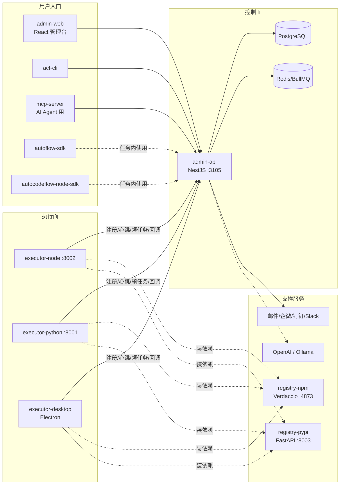
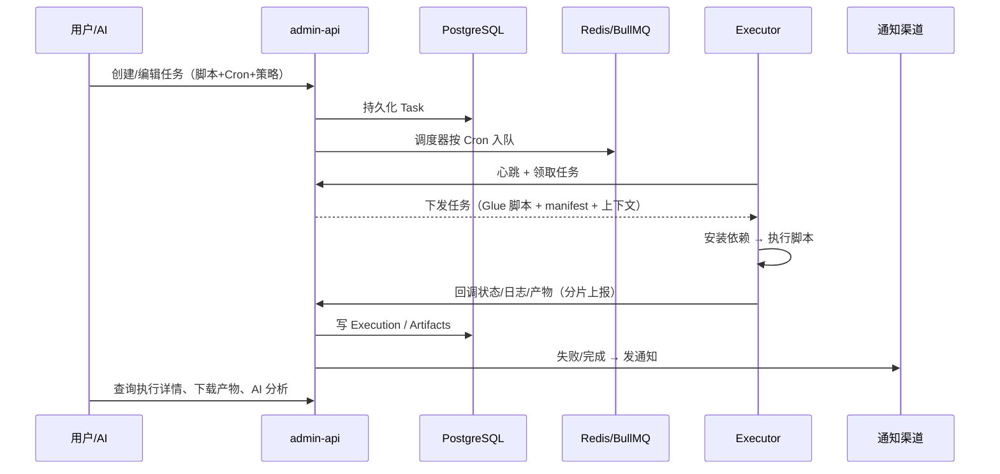

# 总体架构与数据流

> 所属: docs/atlas/00-overview · 最后核对: 2026-09-13 · 对应代码: docker-compose.yml、apps/*、packages/*

## 架构总图

## 组件职责速览

| 组件 | 角色 | 关键端口 | 详细文档 |
|---|---|---|---|
| admin-api | 控制面唯一入口：REST API、调度、回调接收、通知 | 3105 | [../01-apps/admin-api/README.md](../01-apps/admin-api/README.md) |
| admin-web | 管理台 SPA | 经 nginx :80 | [../01-apps/admin-web/README.md](../01-apps/admin-web/README.md) |
| executor-node | Node.js 任务执行 | 8002 | [../01-apps/executor-node/README.md](../01-apps/executor-node/README.md) |
| executor-python | Python 任务执行 | 8001 | [../01-apps/executor-python/README.md](../01-apps/executor-python/README.md) |
| executor-desktop | Electron 桌面执行器（托盘常驻） | - | [../01-apps/executor-desktop/README.md](../01-apps/executor-desktop/README.md) |
| registry-npm / registry-pypi | 私有依赖仓库 | 4873 / 8003 | [../01-apps/registry-npm.md](../01-apps/registry-npm.md) |
| acf-cli / mcp-server / 双 SDK | 编程入口 | - | [../02-packages/README.md](../02-packages/README.md) |

## 核心数据流：一次任务执行

细化拆解见 [../04-flows/task-lifecycle.md](../04-flows/task-lifecycle.md)。

## 关键架构决策（速记）

| 决策 | 内容 | 出处 |
|---|---|---|
| 单体控制面 | 所有控制逻辑集中在 admin-api，执行器无状态化 | docs/adr/ |
| Pull 模型 | 执行器主动拉任务 + 回调上报，避免入站暴露 | 04-flows/executor-registration |
| 双写迁移策略 | development 用 synchronize，其他环境用 migrationsRun | README「数据库迁移」 |
| 多实例支持 | admin-api 多实例 + outbox/claim 模式（ARCH-31） | docs/ARCH-MULTI-INSTANCE-MATRIX.md |
| 各 app 独立安装依赖 | monorepo 不做 workspace hoisting（ARCH-20） | 根 package.json description |

> ⚠️ 待核实：ADR 目录内具体条目清单未逐一核对，引用前请先看 `docs/adr/`。

## 相关文档

- 领域概念: [05-core-concepts.md](05-core-concepts.md)
- 关键流程: [../04-flows/task-lifecycle.md](../04-flows/task-lifecycle.md)
- 部署拓扑: [../06-infra/docker-compose.md](../06-infra/docker-compose.md)
