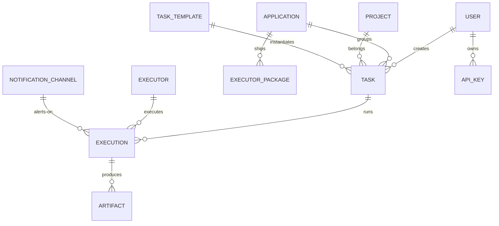

# 领域核心概念与关系

> 所属: docs/atlas/00-overview · 最后核对: 2026-09-13 · 对应代码: apps/admin-api/src/modules/、03-data/entities/

## 概念关系图

## 核心实体速览

| 概念 | 一句话定义 | 生命周期 | 实体文档 |
|---|---|---|---|
| **Task** | 调度单元：Glue 脚本 + Cron + 重试/超时策略 | 创建 → 启用 → (暂停) → 归档 | [task](../03-data/entities/task.md) |
| **Execution** | Task 的一次运行：状态机、日志、耗时、错误 | pending → running → success/failed/timeout/... | 同上 |
| **Executor** | 执行器实例：node/python/desktop，心跳保活 | 注册 → online → offline → 移除 | [../03-data/entities/executor.md](../03-data/entities/executor.md) |
| **Application** | 任务/包/权限的分组边界 | 创建 → 归属任务与包 | [application](../03-data/entities/application.md) |
| **Project** | 应用内的进一步组织单元（待核实具体差异） | — | 同上 |
| **TaskTemplate** | 任务的预填模板（含策略预设） | 保存 → 引用创建 | [task-template](../03-data/entities/task-template.md) |
| **ExecutorPackage** | 应用级安装包，执行器下载安装 | 上传 → 分发 → (版本) | [executor-package](../03-data/entities/executor-package.md) |
| **Artifact** | 执行产物文件 | 执行产生 → 下载/清理 | 同上 |
| **NotificationChannel** | 通知配置（企微/钉钉/Slack/SMTP） | 配置 → 触发 | [notification-channel-config](../03-data/entities/notification-channel-config.md) |
| **AuditLog** | 操作审计 | 自动记录 | 同上 |
| **SystemConfig** | 运行时可调系统参数 | 读写 | [system-config](../03-data/entities/system-config.md) |
| **EventSubscription** | 事件订阅（webhook 等） | 订阅 → 派发 | 同上 |
| **User / ApiKey** | 人与机器的身份 | — | [user](../03-data/entities/user.md) |

## 三条贯穿性概念链

1. **调度链**：Task（定义）→ Scheduler（何时跑）→ Execution（跑了一次）→ RetryPolicy / TimeoutPolicy（跑砸了怎么办）→ TaskDependency（先后顺序）。
2. **分发链**：Executor（谁跑）→ Manifest（跑什么、要什么依赖）→ ExecutorPackage / Registry（依赖从哪来）→ Artifact（跑完留下什么）。
3. **观测链**：Execution 日志 → Notification（主动推人）→ Audit（事后追责）→ Metrics / Health（系统视角）。

## 概念易混点

- **Application vs Project**：Application 是顶层分组（含权限/批量操作），Project 是其内部组织；具体字段差异见实体文档。
- **ExecutorPackage vs Artifact**：前者是"预分发的安装包"，后者是"执行产出的文件"。
- **TaskTemplate vs Task**：模板只用于预填创建表单，不参与调度。
- **Execution 的重试**：重试产生**新的 Execution 记录**并挂到同一重试链，不是复写同一条。

## 相关文档

- 各实体字段级细节: [../03-data/entities/](../03-data/entities/)
- 任务全流程时序: [../04-flows/task-lifecycle.md](../04-flows/task-lifecycle.md)
